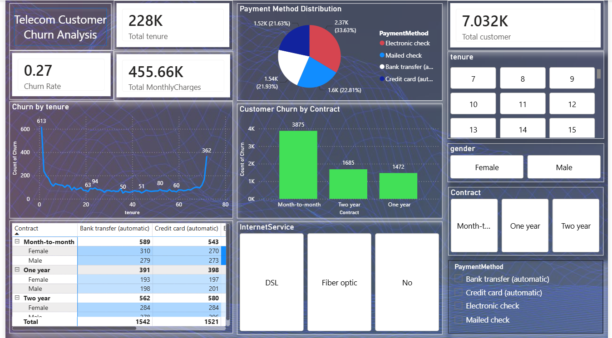

# 📡 Telecom Customer Churn Analysis — Python | SQL | Power BI



> An end-to-end customer churn analysis project for a telecom company — combining data cleaning, predictive modeling, SQL-based analysis, and an interactive Power BI dashboard to identify why customers leave and who is most likely to churn next.

---

## 📁 Repository Structure

```
Telecom-Customer-Churn-Analysis/
│
├── Dataset/                  # Raw and cleaned telecom customer dataset (sourced from Kaggle)
├── Python Analysis/          # Jupyter Notebook for data cleaning, EDA, modeling & segmentation
├── SQL Queries/              # SQL scripts for churn analysis
├── Power BI Dashboard/       # Power BI (.pbix) dashboard file
├── Screenshots/              # Dashboard screenshots
└── README.md
```

---

## 📌 Project Overview

Customer churn is one of the most critical metrics for any subscription-based telecom business — acquiring a new customer typically costs far more than retaining an existing one. This project analyzes a telecom customer dataset sourced from **Kaggle** to understand churn drivers, predict at-risk customers, and segment the customer base for targeted retention strategies.

The project follows a complete analytics pipeline:

1. **Data Cleaning & EDA** with Python
2. **Predictive Modeling** (Logistic Regression) & **Customer Segmentation** with Python
3. **Structured Business Analysis** with SQL
4. **Interactive Visualization** with Power BI Desktop

---

## 🎯 Objectives

- Clean and prepare raw telecom customer data for analysis
- Explore patterns and relationships between customer attributes and churn
- Build a **Logistic Regression model** to predict the probability of customer churn
- Apply **customer segmentation** to group customers by behavior and risk profile
- Write SQL queries to answer key business questions around churn
- Build an interactive Power BI dashboard to communicate findings to stakeholders

---

## 🗃️ Data Source

- **Platform:** [Kaggle](https://www.kaggle.com/)
- **Dataset:** Telecom Customer Churn dataset
- **Key Columns Include:** Customer ID, Tenure, Contract Type, Monthly Charges, Total Charges, Internet Service, Payment Method, Tech Support, Senior Citizen, Churn (Target Variable), and more

---

## 🛠️ Technologies Used

| Tool / Technology | Purpose |
|---|---|
| 🐍 **Python (Pandas, NumPy, Matplotlib, Seaborn)** | Data cleaning, preprocessing & EDA |
| 🤖 **Scikit-learn (Logistic Regression, Clustering)** | Predictive modeling & customer segmentation |
| 🗄️ **SQL** | Data querying and churn analysis |
| 📊 **Power BI Desktop** | Interactive dashboard creation |
| 📓 **Jupyter Notebook** | Python development environment |
| 🗂️ **Kaggle** | Data source |

---

## 🐍 Step 1 — Data Cleaning & EDA with Python

The raw dataset was loaded and cleaned using **Pandas** in a Jupyter Notebook. Key steps included:

- Handling missing and null values (e.g., blank `TotalCharges` entries)
- Removing duplicate records
- Fixing inconsistent data types (converting categorical and numerical columns)
- Encoding categorical variables for modeling
- Exploratory analysis of churn distribution across tenure, contract type, and charges
- Exporting the cleaned dataset for SQL analysis and modeling

📂 **File:** `Python Analysis/Churn_Data_Cleaning_EDA.ipynb`

---

## 🤖 Step 2 — Predictive Modeling & Customer Segmentation

To move from descriptive to predictive insights, two modeling techniques were applied:

### 🔹 Logistic Regression
A **Logistic Regression model** was built to predict the likelihood of a customer churning based on features such as tenure, monthly charges, contract type, and service subscriptions. Model evaluation included:

- Train-test split and feature scaling
- Accuracy, Precision, Recall, F1-Score, and Confusion Matrix
- Identifying the most influential features driving churn (e.g., contract type, tenure, monthly charges)

### 🔹 Customer Segmentation
Customers were segmented into distinct groups based on behavioral and demographic attributes (e.g., tenure, spending, service usage) to identify high-risk segments and tailor retention strategies accordingly.

📂 **File:** `Python Analysis/Churn_Prediction_Segmentation.ipynb`

---

## 🗄️ Step 3 — Data Analysis with SQL

The cleaned dataset was imported into a SQL database and queried to answer key business questions, such as:

- What is the overall customer churn rate?
- Which contract types (month-to-month, one-year, two-year) have the highest churn?
- How does churn vary by tenure groups (new vs. long-term customers)?
- Which payment methods are associated with higher churn?
- Is there a relationship between monthly charges and churn likelihood?
- Which services (Internet, Tech Support, Streaming) correlate most with retention?

📂 **File:** `SQL Queries/Churn_Analysis_Queries.sql`

---

## 📊 Step 4 — Power BI Dashboard

An interactive dashboard was built in **Power BI Desktop** to visualize churn patterns and model insights. The dashboard includes:

- **KPI Cards** — Total Customers, Churn Rate, Average Tenure, Average Monthly Charges
- **Churn by Contract Type** — Bar chart breakdown
- **Churn by Tenure Group** — New vs. long-term customer analysis
- **Churn by Payment Method & Internet Service** — Service-level breakdown
- **Customer Segments** — Visualizing segments identified through clustering
- **High-Risk Customer List** — Customers flagged by the predictive model
- **Interactive Slicers** — Filter by Contract Type, Gender, Senior Citizen status, and Internet Service

📂 **File:** `Power BI Dashboard/Telecom_Churn_Dashboard.pbix`

---

## 💡 Key Insights & Conclusions

Based on the analysis and modeling, the following conclusions were drawn:

- 📉 **Contract Type Matters Most:** Customers on **month-to-month contracts** churned at a significantly higher rate than those on one-year or two-year contracts.
- 🕐 **Early Tenure Risk:** Customers within their **first 12 months** were the most likely to churn, highlighting the importance of strong onboarding and early engagement.
- 💰 **High Monthly Charges Drive Churn:** Customers with **higher monthly charges** (often without long-term contracts) showed a greater tendency to leave.
- 📞 **Lack of Add-On Services Increases Risk:** Customers without **Tech Support** or **Online Security** subscriptions churned more frequently than those with these services.
- 💳 **Payment Method Correlation:** Customers paying via **electronic check** had notably higher churn rates compared to automatic payment methods.
- 🎯 **Model Performance:** The Logistic Regression model achieved solid predictive performance, identifying contract type, tenure, and monthly charges as the top churn predictors.
- 👥 **Segmentation Value:** Customer segmentation revealed a clear **high-risk segment** — low-tenure, high-paying, month-to-month customers — that should be prioritized for retention campaigns.

---

## 🚀 How to Explore This Project

1. **Clone the repository:**
   ```bash
   git clone https://github.com/Rajaneeshkumar-code/Telecom-Customer-Churn-Analysis.git
   ```

2. **Run the Python notebooks:**
   - Open notebooks in `Python Analysis/` using Jupyter Notebook or VS Code
   - Install dependencies: `pip install pandas numpy matplotlib seaborn scikit-learn`

3. **Explore SQL queries:**
   - Import the cleaned dataset into any SQL environment (MySQL / PostgreSQL / SQLite)
   - Run scripts from `SQL Queries/`

4. **Open the dashboard:**
   - Open `Power BI Dashboard/Telecom_Churn_Dashboard.pbix` in Power BI Desktop (free download from Microsoft)

---

## 📬 Connect with Me

- **GitHub:** [Rajaneeshkumar-code](https://github.com/Rajaneeshkumar-code)

---

> ⭐ If you found this project useful, consider giving it a star — it helps others discover it!
